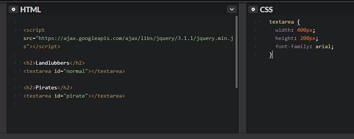
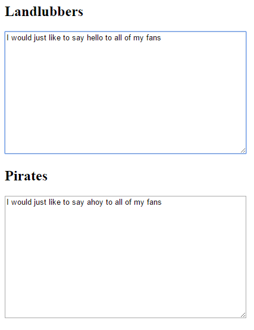
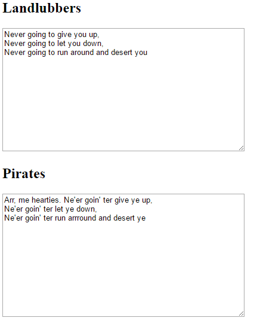

# Talk like a Pirate

In this resource you will create a web page which can translate normal English text into pirate speak using jQuery and regular expressions.

Or, in pirate speak...
Arr, me hearties. In this resource ye will create a web page which can translate normal English text into pirate speak usin' jQuery and regularrr expressions.

## Create a web page

1. Open up a blank file in your chosen text editor and save the file as follows:

 -  If you're using **Notepad** on Windows, type the filename in as `index.html` and change the drop-down for the "Save as" type to **All files**.

  

 - If you're using **TextEdit** on Mac OS, open a new file, then select `Format` > `Make Plain Text`.

  

  Make sure you save the file as `index.html`.

  

 - If you're using **Nano** on a Raspberry Pi, open a terminal window, move to the directory in which you wish to create your web page, and type `nano index.html`.

  

 - Alternatively, you may wish to create this resource entirely within your web browser which you can do using [CodePen](http://codepen.io). Simply open up a new "pen", then **skip the second and third steps**.


2. This HTML code gives you the basic structure of a page. Copy and paste the code into the file you created, then save the file.

  ```html
  <html>
  <head>
    <title>My page</title>
  </head>
  <body>
    My content here
  </body>
  </html>
  ```

3. Go to the folder where you saved your web page. Open the file with your internet browser, so now you'll have the same file open in both your text editor and your browser at the same time.

  On Windows, you may need to right-click the file, choose `Open with`, and then select your internet browser.

  

  Whenever you change the code in your text editor, save it and then press the refresh button on your browser to see the page update.

## Add jQuery

jQuery is a JavaScript library intended to make it easy to use JavaScript. The easiest way to enable jQuery is to use a library hosted online, for example by Google.

1. Copy and paste this line of code between the `<head>` and `</head>` tags of your page, or if you are using CodePen, paste this line into the HTML box:

  ```html
  <script src="https://ajax.googleapis.com/ajax/libs/jquery/3.1.1/jquery.min.js"></script>
  ```
Assuming the computer running your pirate speak web page has an internet connection, you should now have jQuery available. If you want to run the generator without an internet connection, **this code will not work** as your computer will not be able to access the library, so follow the instructions from [w3schools](http://www.w3schools.com/jquery/jquery_get_started.asp) to download a local copy of jQuery.

## Typing in your text

1. You need to add two `<textarea>` boxes. In one of them you will type in the normal text, while the other displays the pirate speak text. These boxes should appear on the page, so this code goes between the `<body>` and `</body>` tags (or in the HTML box if you are using CodePen).

  This code creates a box called "Landlubbers", which is where we will write our normal text. Notice that it has the **id** value `normal`: we are giving the text box a name so we can refer to it later.

  ```html
  <h2>Landlubbers</h2>
  <textarea id="normal"></textarea>
  ```

1. Using this code as an example, add another `<textarea>` box below the first one which will contain the pirate speak text. Set the id to `pirate`.

1. Save the file and refresh your internet browser to check that the textarea boxes appear as expected.

  

1. If you want the textarea boxes to be a bit bigger or to use a different font, you can add CSS code in the `<head>` (or in the CSS section on CodePen) to change the style of the `<textarea>` boxes.

  ```html
  <style type="text/css">
    textarea {
      width: 400px;
      height: 200px;
      font-family: arial;
    }
  </style>
  ```

  

1. Your code so far should look like this if you are using a text editor:

  ```html
  <html>
  <head>
  <style type="text/css">
    textarea {
      width: 400px;
      height: 200px;
      font-family: arial;
    }
  </style>

  <script src="https://ajax.googleapis.com/ajax/libs/jquery/3.1.1/jquery.min.js"></script>

  </head>
  <body>

  <h2>Landlubbers</h2>
  <textarea id="normal"></textarea>

  <h2>Pirates</h2>
  <textarea id="pirate"></textarea>

  </body>
  </html>
  ```

  ...or like this if you are using CodePen

  

## Checking the page has loaded

jQuery allows you to detect when **events** happen on a web page (such as the user typing or clicking on something) and then update the page live in response to the event. We need to check that the page has fully loaded before we start detecting events.

1. If you are using a text editor, add a `<script>` tag and a closing `</script>` tag immediately after the line of code where you imported jQuery. If you are using CodePen, skip this step but **write all of the rest of the code in the JS section of your pen**.

1. Between the `<script>` tags (or in the **JS** section on CodePen), add the following code:

  ```JavaScript
  $(document).ready(function(){
    alert("Page has loaded");
  });
  ```
  In plain English, this code says "Wait until the page has fully loaded, then make a box pop up saying that it has loaded".

  The code may look complicated, so let's break it down:
  - `$(document)` - This identifies what you are talking about, in this case the whole document. This is the **identifier**.
  - `.ready(` - This is a call to a function which means "when it is ready", or "when it has fully loaded". This is the **event**.
  - `function(){` - This creates a function (a section of code) to be executed when the event is triggered.
  - `alert("Page has loaded");` - This makes a box pop up with the message "Page has loaded". This is the **action**.
  - `});` - The ending for the function (`}`), the ending for the `.ready(` call (`)`) and the end of this line of code (`;`)

  We can generalise this as "Wait until [**identifier**] has [**event**] and do [**action**]".

  If you are used to indentation in Python, you might have noticed that in JavaScript, indentation is not essential. It is still advisable to indent your program properly to ensure it is readable - for you, and anyone who may be helping you to create the resource! 

1. Save the code and refresh your web browser. If your jQuery code has worked, you should see a popup box appear when you load the page.

  

## Change text on key press

1. It is always a good idea to include this check for whether the page has loaded in your jQuery programs so that the page does not try to interact with elements which have not yet loaded. However, we don't really want to pop up a box saying the page has loaded every time someone visits our page, so delete the line `alert("Page has loaded");` and instead paste in this code:

  ```JavaScript
  $("#normal").keyup(function(){
    var words = $("#normal").val();

    $("#pirate").val(words);
  });
  ```

  This code says:
  - `$("#normal")` - referring to the textarea with the id `normal` (# means id)... (**identifier**)
  - `.keyup(` - when a key is pressed and let go... (**event**)
  - `function(){` - ...execute the code inside this function... (**action**)

  What do you think the code `var words = $("#normal").val();` means? Can you break it down into parts?
  - `var words =` - we are making a variable called `words` to store some data
  - `$('#normal')` - what is this identifier referring to?
  - `.val();` - this function means "the value of"

  Can you break down the line `$("#pirate").val(words);` and have a guess what it does?

  Predict what will happen when you save the code and type something into the Landlubbers box, then try it and see if you were right.

1. If your code worked correctly, the same words you type in the Landlubbers box should appear in the Pirates box as you type. Although this is not the finished product, it is a good step forward because we now know how to make the contents of the `pirate` textarea change when something is typed in the `normal` textarea.

## Replace words with pirate words

1. To talk like a pirate, we need to replace certain words with their piratical equivalent. For example, we know pirates say "ahoy" instead of "hello". Luckily we know the text that was typed in the Landlubbers text box because we have retrieved and stored it in our `words` variable. Let's use a function to find the word `"hello"` and replace it with `"ahoy"`.

1. Here is a line of code which should be copied and pasted where the gap is left in the previous code, between `var words = $("#normal").val();` and `$("#pirate").val(words);`:

  ```JavaScript
  words = words.replace(/hello/gi, "ahoy");
  ```

  Let's examine this code further:
  - `words =` - Set the value of the variable words equal to...
  - `words.replace(` - ...whatever it was before, but replace...
  - `/hello/gi` - ...the word hello with...
  - `, "ahoy");` - ...the word ahoy

  You might be wondering why the word "hello" is written as `/hello/gi`: this pirate secret will be revealed in the next section!

1. Save your code and test it by typing in a sentence containing the word "hello" in the Landlubbers box. You should see your word replaced with "ahoy" in the Pirates box.

  

1. Now see if you can add more lines of code like this to replace other words with more piratical versions. For example, pirates say "yer" instead of "you", and "avast" instead of "stop". Try looking for pirate speak websites to find out other pirate word substitutions to experiment with! Use the same code, but put in the word you want to find, and the pirate equivalent you want to replace it with.

## Using regular expressions to alter words

So how does the computer know which word we want to replace and what to replace it with? Remember the line of code we wrote to replace "hello" with "ahoy":

```JavaScript
words = words.replace(/hello/gi, "ahoy");
```
You might have wondered why we had to write `/hello/gi` for the word to find, and only `"ahoy"` for the word to replace it with. Why is that? The answer is that to specify the sequence of characters we are looking for, we are actually using something called a **regular expression** (sometimes called a **regex** for short).

A regular expression is a way of specifying a particular sequence of characters to look for in a piece of text.

- The characters we are searching for are put between the slashes `/`, so in this case we are just searching for the word `/hello/`.
- The `g` after the second slash means **global**: we are telling the code to replace the word `hello` with `ahoy` **every time it is found**. If we did not put a `g` here, only the first `hello` found would be replaced.
- The `i` means **case insensitive**: we are telling the code that we don't mind if it finds `Hello` or `HELLO` or even `hELlo'`. All of these will match and will be replaced with `ahoy`.

Regular expressions are extremely powerful: not only can they match exact sequences of characters like `hello`, they can also be used to match patterns of characters. There is a good [guide on how to create a regex](https://developer.mozilla.org/en/docs/Web/JavaScript/Guide/Regular_Expressions), but we wil explain some examples that you could use in your pirate text generator to get you started:

1. You could use the regex character `^` (shift+6 on many keyboards) which means "the start of the text". This code will insert the line `"Arr, me hearties. "` at the start of anything you type!
  ```JavaScript
  words = words.replace(/^/, "Arr, me hearties. ");
  ```

1. You could use the regex `/(\w+)ev(\w+)\s/g`. This one is a bit tricker so we'll break it down:

  - `\w` - matches any single alphanumeric character (so any letter, number, or underscore)
  - `+` - matches the previous pattern one or more times
  - `\w+` - ...so together they mean **any** one or more alphanumeric characters

  - `()` - brackets around any part of a regex mean "save what was matched so we can use it later"

  - `ev` - this is just the normal letters e and v. (Notice that the `\w` had a backslash character to show that it means something different to a normal letter w.)
  - `\s` - this means a single space character
  - `/g` - we already know that the `g` means to match all the instances where this pattern is found

  So, to explain this regex in plain English: "Find ALL matches containing any one or more letters/numbers (and remember them), then the letters ev, then any one or more letters/numbers (and remember them), then a space".

  So this would match any words containing the letters ev such as n**ev**er or what**ev**er, as long as they are followed by a space. Of course, pirates say "ne'er" instead of "never", so we tell the program to reconstruct the word, but with an apostrophe instead of the v.

  - `$1` means what was matched by the first brackets, `$2` means the second brackets and so on...

  In the case of the word "never"
  - `$1` would equal `n` (all letters/numbers up to but not including "ev")
  - `$2` would equal `er` (all letters/numbers after "ev")
  - ...so `"$1e'$2 "` means "the first saved string (n), then e', then the second saved string (er)", which equals `ne'er`

  You might be wondering why we didn't just look up and replace all instances of letter `v` with an apostrophe? Firstly, we wouldn't want to replace the letter `v` at the start of words as we would end up saying things like `'oyage` instead of `voyage` which doesn't make much sense. We also don't want to replace the letter `v` in the middle of words if it doesn't have an `e` before it otherwise we would end up with `shi'er me timbers` which just isn't what a pirate would say.

  Here is the finished code:

  ```JavaScript
  words = words.replace(/(\w+)ev(\w+)\s/g, "$1e'$2 ");
  ```
  Here is our finished pirate text generator with both of these regular expressions demonstrated, as well as some other pirate word replacements.

  


## What next?
- See what you can add to your pirate speech generator! There is a more fully featured example on [CodePen](http://codepen.io/rpflaura/pen/EZQzdx) for you to investigate and try out your pirate speech skills.
- Could you create a generator for any other type of speech? Perhaps you can make people talk like Yoda from Star Wars, or talk in Cockney rhyming slang?
