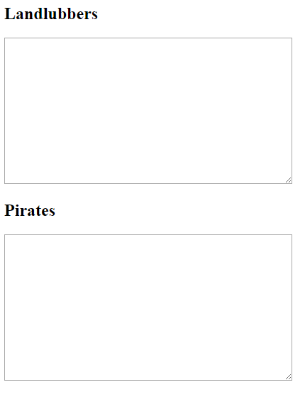
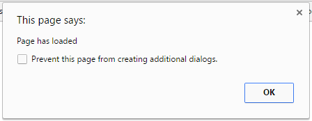

# Talk like a Pirate

In this resource you will create a web page which can translate normal English text into pirate speak, using jQuery and regular expressions.

Or, in pirate speak...
*Arr, me hearties. In this resource ye will create a web page which can translate normal English text into pirate speak, usin' jQuery and regularrr expressions.*

## Create a web page

1. Open up a blank file in your chosen text editor and save the file as follows:

 -  If you're using **Notepad** on Windows, type in the filename as `index.html` and also change the drop-down for the 'Save as' type to *All files*.

  

 - If you're using **TextEdit** on Mac OS, open a new file, then select `Format` > `Make Plain Text`.

  

  Make sure you save the file as `index.html`.

  

 - If you're using **Nano** on a Raspberry Pi, open a terminal window, move to the directory you wish to create your web page in, and type `nano index.html`.

  

 - If you're using [CodePen](http://codepen.io), simply open up a new pen, then **skip steps 2 and 3**.


2. This HTML code gives you the basic structure of a page. Copy and paste the code into the file you created, then save the file.

  ```html
  <html>
  <head>
    <title>My page</title>
  </head>
  <body>
    My content here
  </body>
  </html>
  ```

3. Go to the folder where you saved your web page. Open the file with your internet browser, so now you'll have the same file open in both your text editor and your browser at the same time.

  On Windows, you may need to right-click the file, choose `Open with`, and then select your internet browser.

  

  Whenever you change the code in your text editor, save it and then press the refresh button on your browser to see the page update.

## Add jQuery

jQuery is a JavaScript library intended to make it easy to use JavaScript. The easiest way to enable jQuery is to use a library hosted online, for example by Google.

1. Copy and paste this line of code between the `<head>` and `</head>` tags of your page, or if you are using CodePen, paste this line into the HTML box:

  ```html
  <script src="https://ajax.googleapis.com/ajax/libs/jquery/3.1.1/jquery.min.js"></script>
  ```
Assuming the computer running your pirate speak web page has an internet connection, you should now have jQuery available. If you want to run the generator without an internet connection, **this code will not work** as your computer will not be able to access the library, so follow the instructions from [w3schools](http://www.w3schools.com/jquery/jquery_get_started.asp) to download a local copy of jQuery.


## Typing in your text

1. You need to add two `textarea` boxes - one to type in the normal text and the other to display the pirate speak text. These boxes should appear on the page, so put the code between the `<body>` and `</body>` tags (or in the HTML section if you are using CodePen).

  This code creates a box called "Landlubbers" which is where we will write our normal text. Notice that it has the **id** value `normal` - we are giving the text box a name so we can refer to it later.

  ```html
  <h2>Landlubbers</h2>
  <textarea id="normal"></textarea>
  ```

1. Using this code as an example, add one more `textarea` box which will contain the pirate speak text. Set the id to `pirate`.

1. Save the file and refresh your internet browser to check that the textarea boxes appear as expected.

  

1. If you want the textarea boxes to be a bit bigger or to use a different font, you can add CSS code in the `<head>` (or in the CSS section on CodePen).

  ```html
  <style type="text/css">
    textarea {
      width: 400px;
      height: 200px;
      font-family: arial;
    }
  </style>
  ```

  

1. Your code so far might look like this if you are using a text editor:

  ```html
  <html>
  <head>
  <style type="text/css">
    textarea {
      width: 400px;
      height: 200px;
      font-family: arial;
    }
  </style>

  <script src="https://ajax.googleapis.com/ajax/libs/jquery/3.1.1/jquery.min.js"></script>

  </head>
  <body>

  <h2>Landlubbers</h2>
  <textarea id="normal"></textarea>

  <h2>Pirates</h2>
  <textarea id="pirate"></textarea>

  </body>
  </html>
  ```

  ...or like this if you are using CodePen

  

## Checking the page has loaded

jQuery allows you to detect when *events* happen on a web page (such as the user typing or clicking on something) and then update the page live in response to the event. At the moment when you type into the "Landlubbers" box, nothing happens.

1. If you are using a text editor, add a `<script>` tag and a closing `</script>` tag immediately after the line of code where you imported jQuery. If you are using CodePen, skip this step but write the following code in the **JS** section of your pen.

1. Between the `<script>` tags (or in the **JS** section on CodePen) add the following code:

  ```JavaScript
  $(document).ready(function(){
    alert("Page has loaded");
  });
  ```
  In plain English, this code says "Wait until the page has fully loaded, then pop up a box saying it has loaded.

  The code may look complicated, so let's break it down:
  - `$(document)` - This identifies what you are talking about - in this case the document. This is the **identifier**.
  - `.ready(` - This is a call to a function which means "when it is ready", or "when it has fully loaded". This is the **event**.
  - `function(){` - This creates a function (a section of code) to be executed when the event is triggered. This is the **action**.
  - `alert("Page has loaded");` - This pops up a box with the message "Page has loaded"
  - `});` - The ending for the function (`{`), the ending for the `ready` call (`)`) and the end of this line of code (`;`)

1. Save the code and refresh your web browser. You should see a popup box appear when you load the page.

  


## Change text on key press

1. It is always a good idea to include this check for whether the page has loaded in your jQuery programs so that the page does not try to interact with elements which have not yet loaded. However, we don't really want to pop up a box saying the page has loaded every time someone visits our page, so delete the line `alert("Page has loaded");` and instead paste in this code:

  ```JavaScript
  $("#normal").keyup(function(){
    $('#pirate').val("yarr");
  });
  ```

  This code says:
  - `$("#normal")` - we are talking about the textarea with the id `normal` (`#` means id)... (**identifier**)
  - `.keyup(` - and when a key goes up (is pressed and let go)... (**event**)
  - `function(){` - ...we want to execute the code inside this function... (**action**)

  What do you think the rest of this code does? Can you break it down into parts?
  - `$('#pirate')` - what is this identifier referring to?
  - `.val(` - this means "set the value"
  - `"yarr"` - what does this mean?

  Predict what will happen when you save the code and type something into the "Landlubbers" box, then try it and see if you were right.
